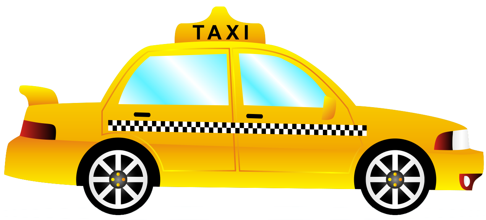

# ResolucionDeProblemasSobre_CSS

 	FORMATO DE INFORME DE PRÁCTICA DE LABORATORIO / TALLERES / CENTROS DE SIMULACIÓN – PARA ESTUDIANTES

CARRERA: Computación 	
ASIGNATURA: HIPERMEDIAL
NRO. PRÁCTICA:	1	TÍTULO PRÁCTICA:
Resolución de problemas sobre CSS3
------------------------------
OBJETIVO ALCANZADO:
---------------------------------------------------
•	Entender y organizar de una mejor manera los sitios de web en Internet.
-------------------------------------------------------
•	Diseñar adecuadamente elementos gráficos en sitios web en Internet.
-----------------------------------------------------
•	Crear sitios web aplicando estándares actuales.
------------------------------------------
ACTIVIDADES DESARROLLADAS
------------------------------------------
1.Realizacion de un diseño de dos columnas con cabecera y pie de página, un diseño a tres columnas con cabecera y pie de página.
--------------------------------------------------------------------

2.Pagina con un diseño de dos columnas con cabecera y pie de página.
Página index.html
Archivo index.css

 ------------------------------------------------------
 
 
 
 
3.Codigo index.html
 -------------------------------   
<!DOCTYPE html>
<html lang="es">
<head>
<meta charset="UTF-8">
<title> Radio Taxy Transporte Confiable</title>
<link rel="stylesheet" href="ArchivoCss/index.css">
</head>

<body>
<header>
<h1>Radio Taxy</h1>
</header>

<header>

</header>

<nav id="menuPrincipal">
<ul>
<li><a href="index.html"><strong> Principal</strong></a></li>
<li><a href="Contactos.html"><strong> Contactos</strong></a></li>
<li><a href="Despacho.html"><strong> Despacho</strong></a></li>
<li><a href="locaciones.html"><strong> Locaciones</strong></a></li>
<li><a href="Tipos.html"><strong>Tipos Transporte</strong></a></li>

</ul>
</nav>

<section>

<article>
<h1>Pagina Principal</h1>

<strong>Taxi</strong> es un medio de transporte público ofrecido por los ayuntamientos con tarifas reguladas que consiste en un
vehículo de transporte con conductor con una autorización de transporte (VT) y una licencia del ayuntamiento, que
ofrece servicios de transporte de una persona o un grupo pequeño de pasajeros dirigidos a igual o diferentes destinos por contrato o dinero. Usualmente, los lugares donde se recoge y se deja al pasajero se deciden por el proveedor
(oferente), mientras que en el caso del taxi, el usuario (demandante) los determina.
<em> Es decir, a diferencia de los otros tipos de transporte de personas, como son las líneas del metro,tranvía o del
autobús, el servicio ofrecido por el taxi se caracteriza por ser puerta a puerta.</em>

<aside id="texto2">

 En la edad media ya existía el arrendamiento de mulas y también los transportistas eran un gremio especializado en la época.En el siglo XVII, en Londres y
París existían empresarios especializados en la cría de caballos y mulas para el alquiler.

</aside>
 

<table class="edicion" >
<caption><samp>TARIFAS DE TRANSPORTE</samp></caption>
<tr>

<td rowspan="2"><strong>Datos</strong></td>
<td colspan="2">Fijo de salida</td>
<tr>
<td><strong>Importe de distancia</strong></td>
<td><strong>Importe por tiempo detenido</strong></td>
</tr>

<tr>
<td><strong>Importe de recargos</strong></td>
<td>Por dia</td>
<td>Por hora</td>
</tr>
<tr>
<td><strong>Importe de recargos</strong></td>
<td>Viajes Nacionales</td>
<td>Viajes Internacionales</td>
</tr>
<tr>
<td
colspan="3"> Radio Taxy Transporte Confiable
</td>
</tr>

</table>

 
<a class="visited"><iframe width="560" height="315" src="https://www.youtube.com/embed/Ewn8jjrrHQU" frameborder="0"
allow="accelerometer; autoplay; encrypted-media; gyroscope; picture-in-picture" allowfullscreen></iframe></a>

<ul class="tamanio">
<li><small>Con la eficiencia</small></li>
<li><small>Con la calidad</small></li>
<li><small>Efectividad</small></li>
<li><small>Inovaccion</small></li>
<li><small>Eficacia</small></li>
</ul>

</article>

<article id="texto3">
 En la mayoría de lugares turísticos también existen bici-taxis y moto-taxis, especialmente en playas y balnearios. Sus precios son cómodos y realizan recorridos cortos dentro de las ciudades costeras.
Movilizarse dentro del Ecuador y sus ciudades es sencillo, sin embargo usted debe tener
en cuenta estos consejos básicos para transportarse de manera fácil y segura.

</article>
<article id="texto2">
 
Otra opción que usted posee es el alquiler de coches. Si va a manejar dentro del país es importante que usted sepa que en Ecuador se conduce por la derecha. Además de la carretera Panamericana que cruza el país desde la frontera colombiana
hasta la frontera peruana, hay una amplia red de vías que recorren el Ecuador.

</article>

</section>

<section>
<article>
<h2>GENERALIDADES</h2>

<aside id="texto3"> En el caso de transporte urbano, un taxi es un medio de transporte que permite desplazamientos rápidos, confortables y directos principalmente en áreas urbanas. El usuario paga una tarifa al conductor, (tarifa que estipula el ayuntamiento, nunca el taxista), a cambio del servicio de transporte prestado. Provee un servicio flexible y conveniente, por lo que es uno de los sistemas de transporte no subvencionado. A diferencia de los sistemas de transporte colectivo, como metro, BRT, tranvía o bus, en los que existen unos principios generales para su diseño, regulación y operación, los sistemas de taxis son mucho más complejos
y tienen muchas más variables a ser consideradas y muchos más actores.</aside>
</article>
<article id="texto3">
 
Una de las formas más comodas y seguras de trasladarse en Ecuador es el taxi, en el caso de las grandes ciudades se recomienda usar sólo taxis amarillos que poseen su credencial a la vista.
En pequeño pueblos y lugares más apartados de las ciudades, el medio de transporte que reemplaza al taxi es la camioneta, éstas no poseen taximetro y se recomienda pactar el costo de la carrera antes de subirse al auto.
Se recomienda que consiga una Guía Vial de Ecuador la cual
puede conseguirla en cualquier librería, tienda turística o en el aeropuerto.
</article>

<article id="texto">
  Es preferible que adquiera un mapa vial antes de iniciar su viaje y debe tener en cuenta que durante el camino encontrará varios peajes, puntos de pago obligatorio para el mantenimiento de vías, en donde cancela de uno a dos dólares. En época de
lluvias es preferible alquilar carros altos ya que las vías pavimentadas se deterioran y se forman los socavones que comúnmente se los conocen aquí con el nombre de baches.
</article>
</section>

<footer> 
<small><strong>&#8226;Jonnathan Enrique Ochoa Calderon
 &#8226;Universidad Politecnica Salesiana
 &#8226;Correo: <a class="link" href="mailto:jochoac6@est.ups.edu.ec">jochoac6@est.ups.edu.ec</a>
 &#8226;Telefono:<a class="hover" href="tel:4132350">4132350</a>
  &#8226;Todos los derechos reservados &#169;
</strong>
</small>

</footer>

</body>
</html>

4.Codigo index.css
 -------------------------------   
Selector por ID
#menuPrincipal{
    width: 10%;
    border-width: 5px ;
    border-right: 5px;
    border-color: brown;
    border-style: ridge;
    border-radius: 30%;
    float: left;
    background: beige;
    
}
=============================================
#contenido{
    width: 79%;
    margin:0 0 0 5px;
    padding: 5px 20px;
    border-width: 5px;
    border-color: rgb(202, 209, 191);
    border-style: groove; 
    text-align: center;
    float: left;
  
}
===============================================
header>a>img{
    height: 240px;
    display:block;
    margin: auto;

}
======================================
#imagen2{
        width: 40%;
        display:block;
        margin: auto;
}
=============================
footer{
        clear: both;
        text-align: center;
        background: bisque;
}
=========================
body{
    background-image:url("../Imagenes/Fondo.jpg");
    
    background-attachment: fixed;
    

}
=========================
div{
    
    color: bisque;
   
}
=========================
header>h1{
    clear: both;
    text-align: center;
    background: bisque;
}
=========================
div section article h1{
    color:yellow;
    text-align: center;
    text-anchor: middle;
    font-size: 200%;

}
=========================

table.edicion{
    color:brown; 
    background: bisque;
    font-size: 200%;
    text-align: center;
    margin: auto;

    
}
=========================

table, th, td {
    border: 1px solid black;

  }

div section article table caption samp{
    color: yellow
}

ul.tamanio{
    text-align:justify;
    font-size: 200%;
    background:bisque;
    color:brown; 
}

div section article h2{
    color:yellow;
    text-align: center;
    text-anchor: middle;
    font-size: 200%;

}
=========================
a:visited{
    color: blueviolet;
    font-weight: bold;
    font-size: 10%;

}
=========================
a:link{
    color: blueviolet;
    font-weight: bold;
    font-size: 100%;
}
=========================
a:hover{
    color: blueviolet;
    font-weight: bold;
    font-size: 100%;
}
=========================
#texto{
    color: burlywood;
    font-size: 150%;
    
}
=========================
#texto2{
    
    font-size: 130%;
    
}
=========================
#texto3{
    color:bisque;
    font-size: 130%;
    
}

5. Pagina con un diseño de tres columnas con cabecera y pie de página.
Página despacho.html
Archivo despacho.css
 -------------------------------   
 
 
6.Página Despacho.html
 -------------------------------   
<!DOCTYPE html>
<html lang="es">
<head>
<meta charset="UTF-8">
<title> Despachos</title>
<link rel="stylesheet" href="ArchivoCss/Despacho.css">
</head>
<body>
<header>

</header>
<header>
<nav>
<ul id="menuPrincipal">
<li><a href="index.html"><strong> Principal</strong></a></li>
<li><a href="Contactos.html"><strong> Contactos</strong></a></li>
<li><a href="Despacho.html"><strong> Despacho</strong></a></li>
<li><a href="locaciones.html"><strong> Locaciones</strong></a></li>
<li><a href="Tipos.html"><strong>Tipos Transporte</strong></a></li>

</ul>
</nav>

<article>
<h1>Despachos</h1>

<dl >
<dt id="texto">
La demanda es servida por la combinación de servicios prestados a través de los
tres segmentos: despacho, calle y contrato.Sin embargo, los segmentos por despacho
y en la calle son los predominantes.
</dt>
<dd id="texto3">
 <strong>Por el segmento de despacho:</strong>solicitado por teléfono o aplicación móvil, a
una central, presta el servicio puerta a puerta, en zonas donde conseguir
un taxi en la calle es difícil,
durante la noche, por la baja demanda, o por seguridad. Al segmento de despacho se puede acceder bien sea llamando a una central donde, por medio de un sistema de radio de dos vías, se busca el taxi, o por otros medios como puede ser teléfonos celulares o Internet.
 
 <strong>Por el segmento de la calle:</strong>
las personas salen a la vía en búsqueda del servicio.
Este segmento se divide a su vez en dos grandes ramas: Taxis de la calle o taxis de
zonas de espera.
 

 <strong>Por el segmento de contrato:</strong>
el usuario contacta directamente al conductor del taxi,
cada vez que quiera que le sea prestado el servicio y se le paga generalmente por
horas o por actividad a un precio diferente al de la tarifa.
</dd>

</dl>

</article>

<article>
<h1>Tarifas</h1>

La tarifa es el valor monetario que se paga en contraprestación del servicio prestado. La tarifa siempre es regulada. O por zonas y precios fijos y cuando no es así, el vehículo debe estar provisto con un dispositivo de medición (taxímetro) para determinar el valor a pagar según la distancia
recorrida. La tarifa puede considerar diferentes parámetros para su cálculo:

<ul class="tamanio">
<li><small>Importe Fijo</small></li>
<li><small>Importe por tiempo detenido</small></li>
<li><small>Importes y recargos segun el dia</small></li>
<li><small>Importes por viajes</small></li>
<li><small>Importes por solicitud de servicios</small></li>
</ul>

</article>
</header>

<footer> 
<small><strong>&#8226;Jonnathan Enrique Ochoa Calderon
 &#8226;Universidad Politecnica Salesiana
 &#8226;Correo: <a class="link" href="mailto:jochoac6@est.ups.edu.ec">jochoac6@est.ups.edu.ec</a>
 &#8226;Telefono:<a class="hover" href="tel:4132350">4132350</a>
 &#8226;Todos los derechos reservados &#169;
</strong>
</small>
</footer>

</body>
</html>

7.Despacho.css
 -------------------------------   
#menuPrincipal{
    width: 10%;
    border-width: 5px ;
    border-right: 5px;
    border-color: brown;
    border-style: ridge;
    border-radius: 30%;
    float: left;
    background: beige;
    
}
=========================
#contenido{
    width: 37%;
    margin:0 0 0 5px;
    padding: 5px 20px;
    border-width: 5px;
    border-color: rgb(202, 209, 191);
    border-style: groove; 
    text-align: center;
    float: left;
  
}
=========================
#contenido2{
    width: 37%;
    margin:0 0 0 5px;
    padding: 5px 20px;
    border-width: 5px;
    border-color:cornsilk;
    border-style: groove; 
    text-align: center;
    float: left;
  
}
=========================
footer{
    clear: both;
    text-align: center;
    background: bisque;
}
=========================
body{
background-image:url("../Imagenes/Fondo.jpg");

background-attachment: fixed;

}

header>img{
    height: 240px;
    display:block;
    margin: auto;
    

}

#imagen2{
    width: 80%;
    display:block;
    margin: auto;
}
=========================
#imagen3{
    width: 100%;
    display:block;
    margin: auto;
}

ul.tamanio{
    text-align:justify;
    font-size: 200%;
    background:bisque;
    color:brown; 
}

div article h1{
    color:yellow;
    text-align: center;
    text-anchor: middle;
    font-size: 200%;

}

#texto{
    color: burlywood;
    font-size: 150%;
    
}

#texto3{
    color:bisque;
    font-size: 130%;
    
}
a:link{
    color: blueviolet;
    font-weight: bold;
    font-size: 100%;
}

a:hover{
    color: blueviolet;
    font-weight: bold;
    font-size: 100%;}

8. Página con un diseño de dos columnas con cabecera y pie de página.
 -------------------------------   
Página locaciones.html
 -------------------------------   
Archivo locaciones.css
 -------------------------------   
 
9.Página locaciones.html
 -------------------------------   
<!DOCTYPE html>
<html lang="es">
 <head>
    <meta charset="UTF-8">
    <title> Locaciones</title>
    <link rel="stylesheet" href="ArchivoCss/locaciones.css">
 </head>
 <body>
     <header>
            
     </header>
     <nav>
            <ul id="menuPrincipal">
                    <li><a href="index.html"><strong> Principal</strong></a></li>
                    <li><a href="Contactos.html"><strong> Contactos</strong></a></li>
                    <li><a href="Despacho.html"><strong> Despacho</strong></a></li>
                    <li><a href="locaciones.html"><strong> Locaciones</strong></a></li>
                    <li><a href="Tipos.html"><strong>Tipos Transporte</strong></a></li>
                    
                </ul>
    </nav>

    

     <article>
            <h1>Locaciones</h1>
            
            <dl id="Locaciones">
                     
                    <dt id="texto">     7 a.m. -  11 p.m.    </dt>
                    <dd id="texto3">CUENCA-AZUAY</dd>
                    
                     
                    <dt id="texto">     9 p.m. - 10 p.m.</dt>
                    <dd id="texto3">CHORDELEG-AZUAY</dd>
                
                     
                    <dt id="texto">     6 p.m. - 8 p.m.</dt>
                    <dd id="texto3">PAUTE-AZUAY</dd>
                    
                 
                </dl>
           
         </article>

       

         <footer>
             <b>&#8226; PROVINCIA DEL AZUAY TELF: (41-32-350)</b>
          </footer>
     
 </body>
</html>

10.locaciones.css
 -------------------------------   
#menuPrincipal{
    width: 10%;
    border-width: 5px ;
    border-right: 5px;
    border-color: brown;
    border-style: ridge;
    border-radius: 30%;
    float: left;
    background: beige;
    
}
=========================
#contenido{
    width: 80%;
    margin:0 0 0 5px;
    padding: 5px 20px;
    border-width: 5px;
    border-color: rgb(202, 209, 191);
    border-style: groove; 
    text-align: center;
    float: left;
  
}
=========================
footer{
    clear: both;
    
    background: bisque;
    display:block;
    margin: auto;
}
=========================
body{
background-image:url("../Imagenes/Fondo.jpg");

background-attachment: fixed;

}

header>img{
    height: 240px;
    display:block;
    margin: auto;
    

}

#texto{
    color: burlywood;
    font-size: 150%;
    display:block;
    margin: auto;
    
}

#texto3{
    color:bisque;
    font-size: 130%;
    display:block;
    margin: auto;
    
}
=========================
div article h1{
    color:yellow;
    text-align: center;
    text-anchor: middle;
    font-size: 200%;

}

#imagen3{
    width: 50%;
    display:block;
    margin: auto;
}

11. Página con un diseño de dos columnas con cabecera y pie de página.
 -------------------------------   
Página Tipos.html
 -------------------------------   
Archivo Tipos.css
 -------------------------------   

 
 
12.Página Tipos.html
 -------------------------------   
<!DOCTYPE html>
<html lang="es">
 <head>
    <meta charset="UTF-8">
    <title> Tipos de Vehiculos</title>
    <link rel="stylesheet" href="ArchivoCss/Tipos.css">
 </head>
 <body>
     <header>
         
     </header>
     <header>
     <nav id="menuPrincipal">
            <ul>
                    <li><a href="index.html"><strong> Principal</strong></a></li>
                    <li><a href="Contactos.html"><strong> Contactos</strong></a></li>
                    <li><a href="Despacho.html"><strong> Despacho</strong></a></li>
                    <li><a href="locaciones.html"><strong> Locaciones</strong></a></li>
                    <li><a href="Tipos.html"><strong>Tipos Transporte</strong></a></li>
                    
                </ul>
    </nav>
     
    

         <article>
             <h1>Vehiculos</h1>
             
             <dl id="Vehiculos">

                     
                    <dt id="texto">TAXY EJECUTIVO</dt>
                    <dd> </dd>
                     
                    
                    
                     
                    <dt id="texto">TAXY COMPOSTELA:</dt>
                    <dd> </dd>
                     
                   
                   
                     
                    <dt id="texto">TAXY NORMAL</dt>
                    <dd></dd>
                     
                    
                    
                     
                    <dt id="texto">TAXY CARGA</dt>
                    <dd> </dd>
                    
                     
                    

                    

             </dl>

         </article>

         

     </header>

    <footer> 
   <small><strong>&#8226;Jonnathan Enrique Ochoa Calderon 
     &#8226;Universidad Politecnica Salesiana
     &#8226;Correo: <a href="mailto:jochoac6@est.ups.edu.ec">jochoac6@est.ups.edu.ec</a> 
     &#8226;Telefono:<a href="tel:4132350">4132350</a> &#8226;Todos los derechos reservados &#169;
   </strong>
</small>
</footer>
 </body>
</html>

13.Tipos.css
 -------------------------------   
#menuPrincipal{
    width: 10%;
    border-width: 5px ;
    border-right: 5px;
    border-color: brown;
    border-style: ridge;
    border-radius: 30%;
    float: left;
    background: beige;
    
}

#contenido{
    width: 80%;
    margin:0 0 0 5px;
    padding: 5px 20px;
    border-width: 5px;
    border-color: rgb(202, 209, 191);
    border-style: groove; 
    text-align: center;
    float: left;
  
}

footer{
    clear: both;
    text-align: center;
    background: bisque;
}
=========================
body{
background-image:url("../Imagenes/Fondo.jpg");

background-attachment: fixed;

}

header>img{
    height: 240px;
    display:block;
    margin: auto;
    

}

#imagen2{
    width: 80%;
    display:block;
    margin: auto;
}

#imagen3{
    width: 100%;
    display:block;
    margin: auto;
}#texto{
    color: burlywood;
    font-size: 150%;
    
}

#texto3{
    color:bisque;
    font-size: 130%;
    
}

div article h1{
    color:yellow;
    text-align: center;
    text-anchor: middle;
    font-size: 200%;

}

14.Creacion de archivos CSS, almacenados en una carpeta llamada Archivos. Reglas CSS relacionas a textos, colores, tablas, secciones, artículos, etc.
  -------------------------------   
#menuPrincipal{
    width: 10%;
    border-width: 5px ;
    border-right: 5px;
    border-color: brown;
    border-style: ridge;
    border-radius: 30%;
    float: left;
    background: beige;
    
}

#contenido{
    width: 37%;
    margin:0 0 0 5px;
    padding: 5px 20px;
    border-width: 5px;
    border-color: rgb(202, 209, 191);
    border-style: groove; 
    text-align: center;
    float: left;
  
}

#contenido2{
    width: 37%;
    margin:0 0 0 5px;
    padding: 5px 20px;
    border-width: 5px;
    border-color:cornsilk;
    border-style: groove; 
    text-align: center;
    float: left;
  
}

footer{
    clear: both;
    text-align: center;
    background: bisque;
}
=========================
body{
background-image:url("../Imagenes/Fondo.jpg");

background-attachment: fixed;

}

header>img{
    height: 240px;
    display:block;
    margin: auto;
    

}

#imagen2{
    width: 80%;
    display:block;
    margin: auto;
}

#imagen3{
    width: 100%;
    display:block;
    margin: auto;
}

ul.tamanio{
    text-align:justify;
    font-size: 200%;
    background:bisque;
    color:brown; 
}

div article h1{
    color:yellow;
    text-align: center;
    text-anchor: middle;
    font-size: 200%;

}

#texto{
    color: burlywood;
    font-size: 150%;
    
}

#texto3{
    color:bisque;
    font-size: 130%;
    
}

a:link{
    color: blueviolet;
    font-weight: bold;
    font-size: 100%;
}

a:hover{
    color: blueviolet;
    font-weight: bold;
    font-size: 100%;}

#menuPrincipal{
    width: 10%;
    border-width: 5px ;
    border-right: 5px;
    border-color: brown;
    border-style: ridge;
    border-radius: 30%;
    float: left;
    background: beige;
    
}

#contenido{
    width: 79%;
    margin:0 0 0 5px;
    padding: 5px 20px;
    border-width: 5px;
    border-color: rgb(202, 209, 191);
    border-style: groove; 
    text-align: center;
    float: left;
  
}

header>a>img{
    height: 240px;
    display:block;
    margin: auto;

}

#imagen2{
        width: 40%;
        display:block;
        margin: auto;
}

footer{
        clear: both;
        text-align: center;
        background: bisque;
}
=========================
body{
    background-image:url("../Imagenes/Fondo.jpg");
    
    background-attachment: fixed;
    

}
=========================
div{
    
    color: bisque;
   
}
=========================
header>h1{
    clear: both;
    text-align: center;
    background: bisque;
}

div section article h1{
    color:yellow;
    text-align: center;
    text-anchor: middle;
    font-size: 200%;

}
=========================

table.edicion{
    color:brown; 
    background: bisque;
    font-size: 200%;
    text-align: center;
    margin: auto;

    
}
=========================

table, th, td {
    border: 1px solid black;

  }

div section article table caption samp{
    color: yellow
}

ul.tamanio{
    text-align:justify;
    font-size: 200%;
    background:bisque;
    color:brown; 
}

div section article h2{
    color:yellow;
    text-align: center;
    text-anchor: middle;
    font-size: 200%;

}
=========================
a:visited{
    color: blueviolet;
    font-weight: bold;
    font-size: 10%;

}

a:link{
    color: blueviolet;
    font-weight: bold;
    font-size: 100%;
}

a:hover{
    color: blueviolet;
    font-weight: bold;
    font-size: 100%;
}

#texto{
    color: burlywood;
    font-size: 150%;
    
}

#texto2{
    
    font-size: 130%;
    
}

#texto3{
    color:bisque;
    font-size: 130%;
    
}

#menuPrincipal{
    width: 10%;
    border-width: 5px ;
    border-right: 5px;
    border-color: brown;
    border-style: ridge;
    border-radius: 30%;
    float: left;
    background: beige;
    
}

#contenido{
    width: 80%;
    margin:0 0 0 5px;
    padding: 5px 20px;
    border-width: 5px;
    border-color: rgb(202, 209, 191);
    border-style: groove; 
    text-align: center;
    float: left;
  
}

footer{
    clear: both;
    
    background: bisque;
    display:block;
    margin: auto;
}
/*Selector por Etiquetas*/
body{
background-image:url("../Imagenes/Fondo.jpg");

background-attachment: fixed;

}

/*Selector por Etiquetas*/
header>img{
    height: 240px;
    display:block;
    margin: auto;
    

}

#texto{
    color: burlywood;
    font-size: 150%;
    display:block;
    margin: auto;
    
}

/*Selector por ID*/
#texto3{
    color:bisque;
    font-size: 130%;
    display:block;
    margin: auto;
    
}
div article h1{
    color:yellow;
    text-align: center;
    text-anchor: middle;
    font-size: 200%;

}
#imagen3{
    width: 50%;
    display:block;
    margin: auto;
}

/*Selector por ID*/
#menuPrincipal{
    width: 10%;
    border-width: 5px ;
    border-right: 5px;
    border-color: brown;
    border-style: ridge;
    border-radius: 30%;
    float: left;
    background: beige;
    
}
/*Selector por ID*/
#contenido{
    width: 80%;
    margin:0 0 0 5px;
    padding: 5px 20px;
    border-width: 5px;
    border-color: rgb(202, 209, 191);
    border-style: groove; 
    text-align: center;
    float: left;
  
}

footer{
    clear: both;
    text-align: center;
    background: bisque;
}
/*Selector por Etiquetas*/
body{
background-image:url("../Imagenes/Fondo.jpg");

background-attachment: fixed;

}

/*Selector por Etiquetas*/
header>img{
    height: 240px;
    display:block;
    margin: auto;
    

}
/*Selector por ID*/
#imagen2{
    width: 80%;
    display:block;
    margin: auto;
}
/*Selector por ID*/
#imagen3{
    width: 100%;
    display:block;
    margin: auto;
}
/*Selector por ID*/
#texto{
    color: burlywood;
    font-size: 150%;
    
}

/*Selector por ID*/
#texto3{
    color:bisque;
    font-size: 130%;
    
}

div article h1{
    color:yellow;
    text-align: center;
    text-anchor: middle;
    font-size: 200%;

}

15.Selectores por etiquetas, selectores descendentes, selectores por clase y selectores por id.
 -------------------------------   
16.Selectores por etiquetas.
 -------------------------------   
table, th, td {
    border: 1px solid black;

  }
footer{
    clear: both;
    text-align: center;
    background: bisque;
}

footer{
    clear: both;
    text-align: center;
    background: bisque;
}
/*Selector por Etiquetas*/
body{
background-image:url("../Imagenes/Fondo.jpg");

background-attachment: fixed;

}
/*Selector por Etiquetas*/
footer{
        clear: both;
        text-align: center;
        background: bisque;
}
/*Selector por Etiquetas*/
body{
    background-image:url("../Imagenes/Fondo.jpg");
    
    background-attachment: fixed;
    

}
/*Selector por Etiquetas*/
div{
    
    color: bisque;
   
}
footer{
    clear: both;
    
    background: bisque;
    display:block;
    margin: auto;
}
/*Selector por Etiquetas*/
body{
background-image:url("../Imagenes/Fondo.jpg");

background-attachment: fixed;

}
footer{
    clear: both;
    text-align: center;
    background: bisque;
}
/*Selector por Etiquetas*/
body{
background-image:url("../Imagenes/Fondo.jpg");

background-attachment: fixed;

}
17.Selectores descendentes
div h1{
    color:yellow;
    text-align: center;
    text-anchor: middle;
    font-size: 200%;

}

    <h1>Contacto</h1>

/*Selector descendente*/
div article h1{
    color:yellow;
    text-align: center;
    text-anchor: middle;
    font-size: 200%;

}

         <article>
             <h1>Despachos</h1>

/*Selector descendente*/
div section article h2{
    color:yellow;
    text-align: center;
    text-anchor: middle;
    font-size: 200%;

}

<section>
        <article>
        <h2>GENERALIDADES</h2>

descencente*/
div section article table caption samp{
    color: yellow
}

/*Selector descendente*/
div section article h1{
    color:yellow;
    text-align: center;
    text-anchor: middle;
    font-size: 200%;

}

div article h1{
    color:yellow;
    text-align: center;
    text-anchor: middle;
    font-size: 200%;

}

div article h1{
    color:yellow;
    text-align: center;
    text-anchor: middle;
    font-size: 200%;

}

18.Selectores por clase
 -------------------------------   
ul.tamanio{
    text-align:justify;
    font-size: 200%;
    background:bisque;
    color:brown; 
}

table.edicion{
    color:brown; 
    background: bisque;
    font-size: 200%;
    text-align: center;
    margin: auto;

    
}

/*Selector por clase*/
ul.tamanio{
    text-align:justify;
    font-size: 200%;
    background:bisque;
    color:brown; 
}

19.Selectores por ID
-------------------------------   
Contacto.css
/*Selector por ID*/
#menuPrincipal{
    width: 10%;
    border-width: 5px ;
    border-right: 5px;
    border-color: brown;
    border-style: ridge;
    border-radius: 30%;
    float: left;
    background: beige;
    
}
/*Selector por ID*/
#contenido{
    width: 50%;
    margin:0 0 0 5px;
    padding: 5px 20px;
    border-width: 5px;
    border-color: rgb(202, 209, 191);
    border-style: groove; 
    text-align: center;
    float: left;
  
}

#imagen3{
    width: 60%;
    display:block;
    margin: auto;
}

#contenido.formulario{
    width: 90%;
    margin-top: 20px;
    text-align: center;
    background:burlywood;
    height: 80%;
    
}
#contenido2{
    width: 20%;
    margin:0 0 0 5px;
    padding: 5px 20px;
    border-width: 5px;
    border-color: rgb(202, 209, 191);
    border-style: groove; 
    text-align: center;
    float: left;
  
}

Despacho.css
/*Selector por ID*/
#menuPrincipal{
    width: 10%;
    border-width: 5px ;
    border-right: 5px;
    border-color: brown;
    border-style: ridge;
    border-radius: 30%;
    float: left;
    background: beige;
    
}
/*Selector por ID*/
#contenido{
    width: 37%;
    margin:0 0 0 5px;
    padding: 5px 20px;
    border-width: 5px;
    border-color: rgb(202, 209, 191);
    border-style: groove; 
    text-align: center;
    float: left;
  
}
/*Selector por ID*/
#contenido2{
    width: 37%;
    margin:0 0 0 5px;
    padding: 5px 20px;
    border-width: 5px;
    border-color:cornsilk;
    border-style: groove; 
    text-align: center;
    float: left;
  
}

/*Selector por ID*/
#imagen2{
    width: 80%;
    display:block;
    margin: auto;
}
/*Selector por ID*/
#imagen3{
    width: 100%;
    display:block;
    margin: auto;
}

/*Selector por ID*/
#texto{
    color: burlywood;
    font-size: 150%;
    
}

/*Selector por ID*/
#texto3{
    color:bisque;
    font-size: 130%;
    
}

Index.css
/*Selector por ID*/
#menuPrincipal{
    width: 10%;
    border-width: 5px ;
    border-right: 5px;
    border-color: brown;
    border-style: ridge;
    border-radius: 30%;
    float: left;
    background: beige;
    
}
/*Selector por ID*/
#contenido{
    width: 79%;
    margin:0 0 0 5px;
    padding: 5px 20px;
    border-width: 5px;
    border-color: rgb(202, 209, 191);
    border-style: groove; 
    text-align: center;
    float: left;
  
}

/*Selector por ID*/
#imagen2{
        width: 40%;
        display:block;
        margin: auto;
}

/*Selector por ID*/
#texto{
    color: burlywood;
    font-size: 150%;
    
}
/*Selector por ID*/
#texto2{
    
    font-size: 130%;
    
}
/*Selector por ID*/
#texto3{
    color:bisque;
    font-size: 130%;
    
}

Locaciones.css
/*Selector por ID*/
#menuPrincipal{
    width: 10%;
    border-width: 5px ;
    border-right: 5px;
    border-color: brown;
    border-style: ridge;
    border-radius: 30%;
    float: left;
    background: beige;
    
}
/*Selector por ID*/
#contenido{
    width: 80%;
    margin:0 0 0 5px;
    padding: 5px 20px;
    border-width: 5px;
    border-color: rgb(202, 209, 191);
    border-style: groove; 
    text-align: center;
    float: left;
  
}

#texto{
    color: burlywood;
    font-size: 150%;
    display:block;
    margin: auto;
    
}

/*Selector por ID*/
#texto3{
    color:bisque;
    font-size: 130%;
    display:block;
    margin: auto;
    
}

}
#imagen3{
    width: 50%;
    display:block;
    margin: auto;
}

Tipos.css
/*Selector por ID*/
#menuPrincipal{
    width: 10%;
    border-width: 5px ;
    border-right: 5px;
    border-color: brown;
    border-style: ridge;
    border-radius: 30%;
    float: left;
    background: beige;
    
}
/*Selector por ID*/
#contenido{
    width: 80%;
    margin:0 0 0 5px;
    padding: 5px 20px;
    border-width: 5px;
    border-color: rgb(202, 209, 191);
    border-style: groove; 
    text-align: center;
    float: left;
  
}

/*Selector por ID*/
#imagen2{
    width: 80%;
    display:block;
    margin: auto;
}
/*Selector por ID*/
#imagen3{
    width: 100%;
    display:block;
    margin: auto;
}
/*Selector por ID*/
#texto{
    color: burlywood;
    font-size: 150%;
    
}

/*Selector por ID*/
#texto3{
    color:bisque;
    font-size: 130%;
    
}

20.Personalizacion etiquetas para títulos (h1 – h6), tanto en color, tamaño, fuente, decoraciones, etc.
Página Contacto.
------------------------------   
#menuPrincipal{
    width: 10%;
    border-width: 5px ;
    border-right: 5px;
    border-color: brown;
    border-style: ridge;
    border-radius: 30%;
    float: left;
    background: beige;
    
}
#contenido{
    width: 50%;
    margin:0 0 0 5px;
    padding: 5px 20px;
    border-width: 5px;
    border-color: rgb(202, 209, 191);
    border-style: groove; 
    text-align: center;
    float: left;
  
}
footer{
    clear: both;
    text-align: center;
    background: bisque;
}
body{
background-image:url("../Imagenes/Fondo.jpg");

background-attachment: fixed;

}
#imagen3{
    width: 60%;
    display:block;
    margin: auto;
}

div h1{
    color:yellow;
    text-align: center;
    text-anchor: middle;
    font-size: 200%;

}

#texto{
    color: burlywood;
    font-size: 90%;
    display:block;
    margin: auto;
    
}

#texto3{
    color:bisque;
    font-size: 90%;
    display:block;
    margin: auto;
    
}
header>a>img{
    height: 240px;
    display:block;
    margin: auto;
    

}

Página Despacho
#menuPrincipal{
    width: 10%;
    border-width: 5px ;
    border-right: 5px;
    border-color: brown;
    border-style: ridge;
    border-radius: 30%;
    float: left;
    background: beige;
    
}

#contenido{
    width: 37%;
    margin:0 0 0 5px;
    padding: 5px 20px;
    border-width: 5px;
    border-color: rgb(202, 209, 191);
    border-style: groove; 
    text-align: center;
    float: left;
  
}
#contenido2{
    width: 37%;
    margin:0 0 0 5px;
    padding: 5px 20px;
    border-width: 5px;
    border-color:cornsilk;
    border-style: groove; 
    text-align: center;
    float: left;
  
}
footer{
    clear: both;
    text-align: center;
    background: bisque;
}
body{
background-image:url("../Imagenes/Fondo.jpg");

background-attachment: fixed;

}

header>img{
    height: 240px;
    display:block;
    margin: auto;
    

}

#imagen2{
    width: 80%;
    display:block;
    margin: auto;
}
#imagen3{
    width: 100%;
    display:block;
    margin: auto;
}

ul.tamanio{
    text-align:justify;
    font-size: 200%;
    background:bisque;
    color:brown; 
}
div article h1{
    color:yellow;
    text-align: center;
    text-anchor: middle;
    font-size: 200%;

}

#texto{
    color: burlywood;
    font-size: 150%;
    
}

#texto3{
    color:bisque;
    font-size: 130%;
    
}

Pagina índex
#menuPrincipal{
    width: 10%;
    border-width: 5px ;
    border-right: 5px;
    border-color: brown;
    border-style: ridge;
    border-radius: 30%;
    float: left;
    background: beige;
    
}
/*Selector por ID*/
#contenido{
    width: 79%;
    margin:0 0 0 5px;
    padding: 5px 20px;
    border-width: 5px;
    border-color: rgb(202, 209, 191);
    border-style: groove; 
    text-align: center;
    float: left;
  
}
/*Selector por Etiquetas*/
header>a>img{
    height: 2px;
    display:block;
    margin: auto;

}
/*Selector por ID*/
#imagen2{
        width: 40%;
        display:block;
        margin: auto;
}
/*Selector por Etiquetas*/
footer{
        clear: both;
        text-align: center;
        background: bisque;
}
/*Selector por Etiquetas*/
body{
    background-image:url("../Imagenes/Fondo.jpg");
    
    background-attachment: fixed;
    

}
/*Selector por Etiquetas*/
div{
    
    color: bisque;
   
}
/*Selector por Etiquetas*/
header>h1{
    clear: both;
    text-align: center;
    background: bisque;
}
/*Selector descendente*/
div section article h1{
    color:yellow;
    text-align: center;
    text-anchor: middle;
    font-size: 200%;

}
/*Selector por clase*/

table.edicion{
    color:brown; 
    background: bisque;
    font-size: 200%;
    text-align: center;
    margin: auto;

    
}
/*Combinacion por selectores*/

table, th, td {
    border: 1px solid black;

  }
/*Combinacion descencente*/
div section article table caption samp{
    color: yellow
}

/*Selector por clase*/
ul.tamanio{
    text-align:justify;
    font-size: 200%;
    background:bisque;
    color:brown; 
}

/*Selector descendente*/
div section article h2{
    color:yellow;
    text-align: center;
    text-anchor: middle;
    font-size: 200%;

}
/*pseudo-clases*/
a:visited{
    color: blueviolet;
    font-weight: bold;
    font-size: 10%;

}
/* pseudo-clases*/
a:link{
    color: blueviolet;
    font-weight: bold;
    font-size: 100%;
}
/* pseudo-clases*/
a:hover{
    color: blueviolet;
    font-weight: bold;
    font-size: 100%;
}
/*Selector por ID*/
#texto{
    color: burlywood;
    font-size: 150%;
    
}
/*Selector por ID*/
#texto2{
    
    font-size: 130%;
    
}
/*Selector por ID*/
#texto3{
    color:bisque;
    font-size: 130%;
    
}

-------------------------------   
Pagina locaciones
-------------------------------   
#menuPrincipal{
    width: 10%;
    border-width: 5px ;
    border-right: 5px;
    border-color: brown;
    border-style: ridge;
    border-radius: 30%;
    float: left;
    background: beige;
    
}
/*Selector por ID*/
#contenido{
    width: 80%;
    margin:0 0 0 5px;
    padding: 5px 20px;
    border-width: 5px;
    border-color: rgb(202, 209, 191);
    border-style: groove; 
    text-align: center;
    float: left;
  
}

footer{
    clear: both;
    
    background: bisque;
    display:block;
    margin: auto;
}
/*Selector por Etiquetas*/
body{
background-image:url("../Imagenes/Fondo.jpg");

background-attachment: fixed;

}

/*Selector por Etiquetas*/
header>img{
    height: 240px;
    display:block;
    margin: auto;
    

}

#texto{
    color: burlywood;
    font-size: 150%;
    display:block;
    margin: auto;
    
}

/*Selector por ID*/
#texto3{
    color:bisque;
    font-size: 130%;
    display:block;
    margin: auto;
    
}
div article h1{
    color:yellow;
    text-align: center;
    text-anchor: middle;
    font-size: 200%;

}
#imagen3{
    width: 50%;
    display:block;
    margin: auto;
}
-------------------------------   
Paginas Tipos
-------------------------------   
#menuPrincipal{
    width: 10%;
    border-width: 5px ;
    border-right: 5px;
    border-color: brown;
    border-style: ridge;
    border-radius: 30%;
    float: left;
    background: beige;
    
}
/*Selector por ID*/
#contenido{
    width: 80%;
    margin:0 0 0 5px;
    padding: 5px 20px;
    border-width: 5px;
    border-color: rgb(202, 209, 191);
    border-style: groove; 
    text-align: center;
    float: left;
  
}

footer{
    clear: both;
    text-align: center;
    background: bisque;
}
/*Selector por Etiquetas*/
body{
background-image:url("../Imagenes/Fondo.jpg");

background-attachment: fixed;

}

/*Selector por Etiquetas*/
header>img{
    height: 240px;
    display:block;
    margin: auto;
    

}
/*Selector por ID*/
#imagen2{
    width: 80%;
    display:block;
    margin: auto;
}
/*Selector por ID*/
#imagen3{
    width: 100%;
    display:block;
    margin: auto;
}
/*Selector por ID*/
#texto{
    color: burlywood;
    font-size: 150%;
    
}

/*Selector por ID*/
#texto3{
    color:bisque;
    font-size: 130%;
    
}

div article h1{
    color:yellow;
    text-align: center;
    text-anchor: middle;
    font-size: 200%;

}
-------------------------------   
21.Pseudo class.Agregación a todas las paginas mencionas anteriormente.
-------------------------------   
a:link{
    color: blueviolet;
    font-weight: bold;
    font-size: 100%;
}
/* pseudo-clases*/
a:hover{
    color: blueviolet;
    font-weight: bold;
    font-size: 100%;}

/*pseudo-clases*/
a:visited{
    color: blueviolet;
    font-weight: bold;
    font-size: 10%;

}
/* pseudo-clases*/
a:link{
    color: blueviolet;
    font-weight: bold;
    font-size: 100%;
}
/* pseudo-clases*/
a:hover{
    color: blueviolet;
    font-weight: bold;
    font-size: 100%;
}
-------------------------------   
22.Menú bordes ovalados, con color de fondo y una separación entre cada menú de al menos 5px. (Todas las paginas).
-------------------------------   
#menuPrincipal{
    width: 10%;
    border-width: 5px;
    border-right: 5px;
    border-color: brown;
    border-style: ridge;
    border-radius: 30%;
    float: left;
    background: beige;
    
}

<nav id="menuPrincipal">
            <ul>
                    <li><a href="index.html"><strong> Principal</strong></a></li>
                    <li><a href="Contactos.html"><strong> Contactos</strong></a></li>
                    <li><a href="Despacho.html"><strong> Despacho</strong></a></li>
                    <li><a href="locaciones.html"><strong> Locaciones</strong></a></li>
                    <li><a href="Tipos.html"><strong>Tipos Transporte</strong></a></li>
                    
                </ul>
    </nav>

 -------------------------------    
23.Creación una nueva página HTML, en donde, se muestre un formulario de contacto que tenga los siguientes campos (nombre, correo electrónico, mensaje y botón para enviar).Gama de máximo cinco colores.
  -------------------------------   

#contenido.formulario{
    width: 90%;
    margin-top: 20px;
    text-align: center;
    background:burlywood;
    height: 80%;
    
}
#contenido2{
    width: 20%;
    margin:0 0 0 5px;
    padding: 5px 20px;
    border-width: 5px;
    border-color: rgb(202, 209, 191,200,300);
    border-style: groove; 
    text-align: center;
    float: left;
  
}

  -------------------------------   
24.Total de reglas 66.

 -------------------------------   

-------------------------------   

25.Validaciones.
-------------------------------   

26.Enlace del repositorio 
-------------------------------   
https://github.com/UPSJhona/ResolucionDeProblemasSobre_CSS
Usuario: UPSJhona 
  
-------------------------------   

CONCLUSIONES:
•	Los archivos css nos permiten como usuarios poder personalizar nuestras paginas web ya que al crear solo archivos HTML necesitamos personalizar tanto imágenes como textos fondos entre demás cosas por eso se establece que HTML siempre conllevo de la mano con css y los dos son importantes para el desarrollo de la web.
-------------------------------   
•	Eficaz, precisó y fácil de utilizar gracias a su nueva estructura y nuevos elementos. 
-------------------------------   
•	Autoaprendizaje para modificar paginas web a gran abundancia. Con autoría del usuario que lo usa.
-------------------------------   
Nombre del estudiante: Jonnathan Ochoa
-------------------------------   

 
